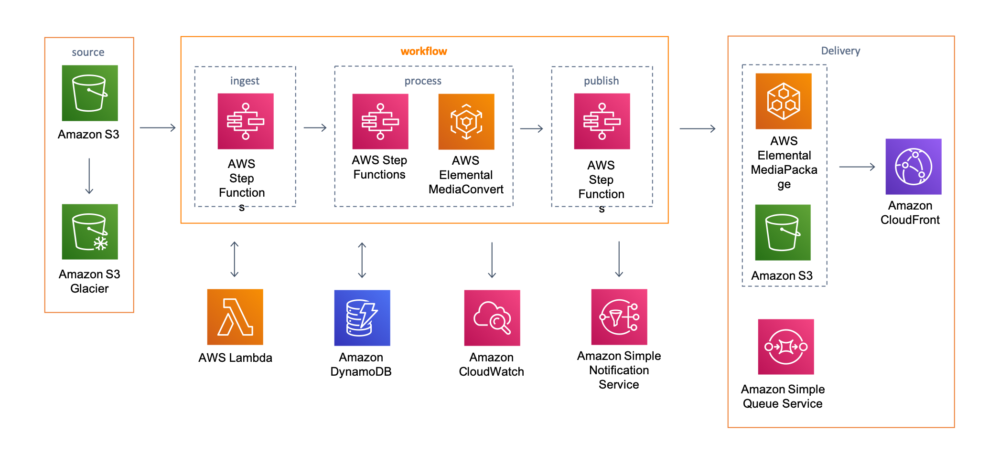

# Video on Demand on AWS - Terraform Implementation

Modern serverless video processing solution on AWS using Terraform Infrastructure as Code. This implementation leverages AWS Step Functions, AWS Elemental MediaConvert, and AWS Elemental MediaPackage to create a scalable, automated video processing pipeline.

## 🏗️ Architecture Overview



This solution implements a **3-stage workflow** for video processing:

1. **Ingest Stage**: Validates input → Extracts metadata → Updates tracking
2. **Process Stage**: Profiles video → Submits encoding job → Monitors progress
3. **Publish Stage**: Validates output → Archives source → Creates MediaPackage assets → Sends notifications

## 🚀 Quick Start

### Prerequisites
- **AWS CLI** configured with appropriate permissions
- **Terraform** >= 1.5.0
- **Node.js** >= 22.0.0 and npm
- **PowerShell** (Windows) or Bash (Linux/macOS)

### 1. Clone and Configure
```powershell
git clone <repository-url>
cd fullstack-vod-architecture/IaC
cp terraform.tfvars.example terraform.tfvars
# Edit terraform.tfvars with your configuration
```

### 2. Deploy Infrastructure
```powershell
# Option 1: Full deployment with interactive prompts
.\deploy.ps1

# Option 2: Quick deployment (skip dependency check and plan)
.\deploy.ps1 -SkipPlan -SkipDependencies

# Option 3: Help and usage information
.\deploy.ps1 -Help
```

### 3. Configuration Options

Key variables in `terraform.tfvars`:
```hcl
# Core Configuration
aws_region         = "us-east-1"
stack_name         = "vod-solution"
admin_email        = "admin@example.com"

# Feature Toggles
enable_media_package    = "Yes"  # Enable MediaPackage VOD
enable_sns              = "Yes"  # Enable SNS notifications
enable_sqs              = "Yes"  # Enable SQS queue
frame_capture          = "Yes"  # Enable thumbnail generation
accelerated_transcoding = "PREFERRED"  # ENABLED, PREFERRED, DISABLED

# Advanced Options
workflow_trigger = "VideoFile"  # VideoFile or MetadataFile
glacier         = "GLACIER"     # GLACIER, DEEP_ARCHIVE
```

## 📁 Project Structure

```
IaC/
├── 📄 main.tf                    # Main Terraform configuration
├── 📄 variables.tf              # Variable definitions  
├── 📄 outputs.tf                # Output definitions
├── 🛠️ deploy.ps1                # Deployment script
├── 🛠️ create-lambda-functions-dependencies.ps1  # Lambda build script
├── 📁 modules/                   # Terraform modules
│   ├── 📁 storage/              # S3 buckets and lifecycle policies
│   ├── 📁 lambda/               # Lambda functions and IAM roles
│   ├── 📁 step_functions/       # Step Functions workflows
│   ├── 📁 database/             # DynamoDB table
│   ├── 📁 messaging/            # SNS topics and SQS queues
│   ├── 📁 cloudfront/           # CloudFront distribution
│   ├── 📁 custom_resources/     # CloudFormation custom resources
│   ├── 📁 events/               # EventBridge rules
│   └── 📁 s3_notifications/     # S3 event notifications
├── 📁 lambda_functions/         # Lambda function source code
│   ├── 📁 input-validate/       # Input validation (Node.js 22)
│   ├── 📁 mediainfo/            # Video metadata extraction (Python 3.13)
│   ├── 📁 profiler/             # Template selection logic (Node.js 22)
│   ├── 📁 encode/               # MediaConvert job submission (Node.js 22)
│   ├── 📁 dynamo-update/        # DynamoDB operations (Node.js 22)
│   ├── 📁 output-validate/      # Output validation (Node.js 22)
│   ├── 📁 archive-source/       # Source archiving (Node.js 22)
│   ├── 📁 media-package-assets/ # MediaPackage integration (Node.js 22)
│   ├── 📁 sns-notification/     # SNS notifications (Node.js 22)
│   ├── 📁 sqs-publish/          # SQS publishing (Node.js 22)
│   ├── 📁 error-handler/        # Error handling (Node.js 22)
│   ├── 📁 step-functions/       # Workflow orchestration (Node.js 22)
│   └── 📁 custom-resource/      # Custom resource handler (Node.js 22)
└── 📁 templates/                # CloudFormation templates and configs
```

## 🎬 Workflow Configuration

### Environment Variables
Each Lambda function is configured with environment variables for:
- **Archive Source**: Automated Glacier archiving of source files
- **CloudFront**: Content delivery network domain for playback URLs
- **Frame Capture**: Thumbnail generation from video content
- **MediaConvert Templates**: Dynamic template selection based on source resolution
- **Workflow Tracking**: Comprehensive job monitoring and status updates

### Workflow Triggers

#### 🎥 Source Video Option (Default)
Triggers on video file uploads to the source S3 bucket.
**Supported formats**: MP4, MPG, MPEG, M4V, MOV, M2TS, MTS, TS, AVI, MKV, WMV, FLV, WebM, 3GP, ASF, VOB

#### 📋 Source Metadata Option  
Triggers on JSON metadata file uploads, allowing per-video configuration.

**Example metadata file**:
```json
{
    "srcVideo": "example.mp4",
    "archiveSource": true,
    "frameCapture": true,
    "jobTemplate": "custom-template-name",
    "inputRotate": "AUTO",
    "title": "My Video Title",
    "genre": "Documentary"
}
```

## 🎯 Intelligent Template Selection

The **Profiler Lambda** automatically selects optimal MediaConvert templates based on source video resolution to **prevent upscaling**:

```javascript
// Smart template selection prevents quality degradation
if (srcHeight >= 2160 && srcWidth >= 3840) return template2160p;
else if (srcHeight >= 1080 && srcWidth >= 1920) return template1080p;
else if (srcHeight >= 720 && srcWidth >= 1280) return template720p;
// Falls back to source resolution if lower than 720p
```

**Available Templates**:
- **2160p (4K)**: UHD content with multiple bitrates
- **1080p (HD)**: Full HD with adaptive streaming
- **720p (SD)**: Standard definition with mobile optimization

## ⚡ Advanced Features

### QVBR (Quality-defined Variable Bitrate)
Optimized encoding settings for OTT and VOD content:

| Resolution | Max Bitrate | QVBR Quality Level |
|------------|-------------|-------------------|
| 2160p      | 15,000 Kbps | 9                |
| 1080p      | 8,500 Kbps  | 8                |
| 720p       | 6,000 Kbps  | 8                |
| 540p       | 3,500 Kbps  | 7                |
| 360p       | 1,500 Kbps  | 7                |

### Accelerated Transcoding
AWS MediaConvert Pro Tier feature options:
- **ENABLED**: All jobs use acceleration (fails on unsupported content)
- **PREFERRED**: Uses acceleration when supported, graceful fallback
- **DISABLED**: Standard transcoding only

### MediaPackage VOD Integration
Automatic content packaging for:
- **HLS**: iOS and Safari compatibility
- **DASH**: Android and modern browsers  
- **CMAF**: Universal format for all devices

## 🛠️ Development & Customization

### Building Lambda Dependencies
```powershell
# Install all dependencies
.\create-lambda-functions-dependencies.ps1

# Clean build (removes existing node_modules)
.\create-lambda-functions-dependencies.ps1 -Clean

# Verbose output for troubleshooting
.\create-lambda-functions-dependencies.ps1 -Verbose
```

### Source Code Structure
### Source Code Structure

#### Lambda Functions (Node.js 22)
- **input-validate**: S3 event parsing and workflow parameter definition
- **profiler**: Intelligent template selection based on source video resolution  
- **encode**: MediaConvert job submission with fallback template logic
- **dynamo-update**: DynamoDB state management and tracking
- **output-validate**: MediaConvert job completion processing
- **archive-source**: S3 lifecycle management and Glacier archiving
- **media-package-assets**: MediaPackage VOD asset creation and management
- **sns-notification**: SNS notification delivery
- **sqs-publish**: SQS message publishing
- **error-handler**: Centralized error handling and notifications
- **step-functions**: Workflow orchestration and execution
- **custom-resource**: CloudFormation custom resource management

#### Python Functions (Python 3.13)
- **mediainfo**: Advanced video metadata extraction and analysis

### Backend Configuration
The solution supports flexible backend configuration:

```hcl
# Create backend.conf file for your environment
bucket         = "your-terraform-state-bucket"
key            = "vod/terraform.tfstate" 
region         = "us-east-1"
dynamodb_table = "your-terraform-lock-table"
```

Initialize with backend configuration:
```powershell
terraform init -backend-config="backend.conf"
```

## 📊 Monitoring & Troubleshooting

### CloudWatch Integration
- **Lambda Logs**: Structured logging with request/response tracking
- **Step Functions**: Visual workflow execution monitoring
- **MediaConvert**: Job progress and error tracking
- **Custom Metrics**: Solution-specific performance indicators

### Error Handling
- **Centralized Error Handler**: Captures and processes all workflow errors
- **SNS Notifications**: Real-time error alerts to administrators
- **DynamoDB Tracking**: Persistent error state and retry information
- **CloudWatch Alarms**: Automated monitoring and alerting

### Common Issues & Solutions

#### Template Not Found Errors
The encode function includes comprehensive fallback logic:
1. Try original template name
2. Try template with `_fixed` suffix  
3. Try alternate template type (`_mvod_` ↔ `_qvbr_`)
4. Try fixed version of alternate template

#### MediaConvert Endpoint Resolution
Automatic endpoint discovery with fallback to environment variables:
```javascript
// Dynamic endpoint resolution
const endpoints = await mediaconvert.describeEndpoints({});
const discovered = endpoints?.Endpoints?.[0]?.Url;
```

## 🔧 Configuration Examples

### Multi-Environment Setup
```hcl
# dev.tfvars
stack_name              = "vod-dev"
enable_media_package    = "No"
accelerated_transcoding = "DISABLED"

# prod.tfvars  
stack_name              = "vod-prod"
enable_media_package    = "Yes"
accelerated_transcoding = "PREFERRED"
```

### Custom Template Configuration
```json
{
    "srcVideo": "content.mp4",
    "jobTemplate": "custom-4k-template",
    "frameCapture": true,
    "archiveSource": false,
    "metadata": {
        "title": "Custom Content",
        "category": "Premium",
        "tags": ["4K", "HDR"]
    }
}
```

## 📈 Performance Optimization

### Resolution-Based Processing
- **Source Analysis**: Automatic detection of video resolution and format
- **Template Matching**: Prevents upscaling by selecting appropriate templates
- **Bitrate Optimization**: QVBR settings tuned for each resolution tier
- **Format Selection**: CMAF for universal device compatibility

### Cost Optimization
- **Intelligent Archiving**: Automatic Glacier lifecycle policies
- **Accelerated Transcoding**: Use PREFERRED mode for cost-effective acceleration
- **Template Efficiency**: Single universal template reduces management overhead
- **Resource Tagging**: Comprehensive tagging for cost allocation

## 🔒 Security Best Practices

### IAM Permissions
- **Least Privilege**: Each Lambda function has minimal required permissions
- **Resource-Specific**: ARNs scoped to specific resources where possible
- **Cross-Service**: Proper service-to-service authentication

### Data Protection
- **Encryption**: S3 buckets with server-side encryption
- **VPC Integration**: Optional VPC deployment for network isolation
- **Access Logging**: CloudTrail and S3 access logs for audit trails

## 🚀 Deployment Strategies

### Development Workflow
```powershell
# 1. Development deployment
.\deploy.ps1 -SkipPlan

# 2. Testing with clean dependencies  
.\deploy.ps1 -Clean

# 3. Production deployment with validation
.\deploy.ps1  # Full deployment with plan review
```

### CI/CD Integration
```yaml
# Example GitHub Actions workflow
- name: Deploy Infrastructure
  run: |
    cd IaC
    terraform init -backend-config="prod.backend.conf"
    terraform plan -var-file="prod.tfvars"
    terraform apply -auto-approve
```

## 📚 Additional Resources

### AWS Services Documentation
- [AWS Elemental MediaConvert](https://docs.aws.amazon.com/mediaconvert/) - Video processing and transcoding
- [AWS Elemental MediaPackage](https://docs.aws.amazon.com/mediapackage/) - Video packaging and delivery
- [AWS Step Functions](https://docs.aws.amazon.com/step-functions/) - Serverless workflow orchestration
- [AWS Lambda](https://docs.aws.amazon.com/lambda/) - Serverless compute
- [Amazon CloudFront](https://docs.aws.amazon.com/cloudfront/) - Global content delivery
- [Terraform AWS Provider](https://registry.terraform.io/providers/hashicorp/aws/latest/docs) - Infrastructure as Code

### Related Solutions
- [Live Streaming on AWS](https://aws.amazon.com/solutions/implementations/live-streaming-on-aws/)
- [Media Analysis Solution](https://aws.amazon.com/solutions/implementations/media-analysis-solution/)
- [Content Analysis on AWS](https://aws.amazon.com/solutions/implementations/content-analysis-on-aws/)

### Learning Resources  
- [AWS Media Services Workshop](https://catalog.us-east-1.prod.workshops.aws/workshops/36b2f876-bb16-4b35-b530-96b894833cdc/en-US)
- [Serverless Video Processing](https://aws.amazon.com/getting-started/hands-on/serverless-video-processing/)
- [MediaConvert Best Practices](https://docs.aws.amazon.com/mediaconvert/latest/ug/best-practices.html)

## Architecture Overview


## Deployment
The solution is deployed using a CloudFormation template with a lambda backed custom resource.
For details on deploying the solution please see the details on the solution home page:
[Video on Demand on AWS][vod-landing]

> **Please ensure you test the new template before updating any production deployments.**

## Workflow Configuration
The workflow configuration is set at deployment and is defined as environment variables for the 
input-validate lambda function (which is the first step in the ingest process).

#### Environment Variables:
* **Archive Source:**	If enabled, the source video file will be tagged for archiving to glacier at 
  the end of the workflow
* **CloudFront:**	CloudFront domain name, used to generate the playback URLs for the MediaConvert 
  outputs
* **Destination:**	The name of the destination S3 bucket for all of the MediaConvert outputs
* **FrameCapture:**	If enabled frame capture is added to the job submitted to MediaConvert
* **InputRotate:**	Defines how the MediaConvert rotates your video
* **MediaConvert_Template_2160p:**	The name of the UHD template in MediaConvert
* **MediaConvert_Template_1080p:**	The name of the HD template in MediaConvert
* **MediaConvert_Template_720p:**	The name of the SD template in MediaConvert
* **Source:**	The name of the source S3 bucket
* **WorkflowName:**	Used to tag all of the MediaConvert encoding jobs
* **acceleratedTranscoding** Enabled Accelerated Transcoding in MediaConvert. options include
  ENABLE, DISABLED, PREFERRED. for more details please see:
  [Accelerated Transcoding][accelerated-transcoding].
* **enableSns** Send SNS notifications for the workflow results.
* **enableSqs** Send the workflow results to an SQS queue

### WorkFlow Triggers

#### Source Video Option
If deployed with the workflow trigger parameter set to VideoFile, the CloudFormation template will
configure S3 event notifications on the source S3 bucket to trigger the workflow whenever a video
file is uploaded. Supported video formats include: MP4, MPG, MPEG, M4V, MOV, M2TS, MTS, TS, AVI, 
MKV, WMV, FLV, WebM, 3GP, ASF, and VOB.

#### Source Metadata Option
If deployed with the workflow trigger parameter set to MetadataFile, the S3 notification is
configured to trigger the workflow whenever a JSON file is uploaded. This allows different workflow
configuration to be defined for each source video processed by the workflow.

> **Important:** The source video file must be uploaded to S3 before the metadata file is uploaded,
and the metadata file must be valid JSON with a .json file extension. With source metadata enabled
uploading video files to Amazon S3 will not trigger the workflow.

**Example JSON metadata file:**
```
{
    "srcVideo": "example.mpg",
    "archiveSource": true,
    "frameCapture": false,
    "jobTemplate": "custom-job-template"
}
```

The only required field for the metadata file is the **srcVideo**. The workflow will default to the
environment variables settings for the ingest validate lambda function for any settings not defined
in the metadata file.

**Full list of options:**
```
{
    "srcVideo": "string",
    "archiveSource": string,
    "frameCapture": boolean,
    "srcBucket": "string",
    "destBucket": "string",
    "cloudFront": "string",
    "jobTemplate": "custom-job-template",
    # Legacy template options (deprecated - use jobTemplate instead)
    "jobTemplate_2160p": "string",
    "jobTemplate_1080p": "string", 
    "jobTemplate_720p": "string",
    "inputRotate": "DEGREE_0|DEGREES_90|DEGREES_180|DEGREES_270|AUTO",
    "captions": {
        "srcFile": "string",
        "fontSize": integer,
        "fontColor": "WHITE|BLACK|YELLOW|RED|GREEN|BLUE"
    }
}
```

The solution also supports adding additional metadata, such as title, genre, or any other
information, you want to store in Amazon DynamoDB.

## Encoding Templates
At launch the Solution creates a single universal MediaConvert job template that outputs CMAF format
compatible with both iOS and Android devices:
- **MediaConvert_Template_Universal** - Single adaptive bitrate template supporting all resolutions (2160p, 1080p, 720p, 540p, 360p)

The universal template automatically creates multiple bitrate outputs optimized for mobile devices,
eliminating the need for separate templates based on source video resolution. The profiler step
now uses the universal template for all video processing, which generates CMAF (Common Media Application Format)
outputs that work seamlessly on both iOS (HLS) and Android (DASH) platforms.

To customize the encoding template used by the solution you can either
replace the existing template or you can use the source metadata version of
the workflow and define the jobTemplate as part of the source metadata file.

**To replace the template:**
1.	Use the system template or create a new universal template through the MediaConvert console
(see the AWS Elemental MediaConvert documentation for details).
2.	Alternatively, modify the JSON template file at `IaC/templates/universal_cmaf_template.json` and re-run the template creation script.
3.	Update the environment variables for the input validate lambda function
with the names of the new templates.

**To define the job template using metadata:**
1.	Launch the solution with source metadata parameter. See Appendix E for more details.
2.	Use the system templates or create a new template through the MediaConvert console
(see the AWS Elemental MediaConvert documentation for details).
3.	Add "jobTemplate":"name of the template" to the metadata file,
this will overwrite the profiler step in the process Step Functions.

## QVBR Mode
AWS MediaConvert Quality-defined Variable Bit-Rate (QVBR) control mode
gets the best video quality for a given file size and is recommended for OTT
and Video On Demand Content. The solution supports this feature and it will create
HLS, MP4 and DASH custom presets with the following QVBR levels
and Single Pass HQ encoding:

| Resolution   |      MaxBitrate      |  QvbrQualityLevel |
|----------|:-------------:|------:|
| 2160p |  15000Kbps | 9 |
| 1080p |  8500Kbps  | 8 |
| 720p  |  6000Kbps  | 8 |
| 720p  |  5000Kbps  | 8 |
| 540p  |  3500Kbps  | 7 |
| 360p  |  1500Kbps  | 7 |
| 270p  |  400Kbps   | 7 |

For more detail please see
[QVBR and MediaConvert](https://docs.aws.amazon.com/mediaconvert/latest/ug/cbr-vbr-qvbr.html).

## Accelerated Transcoding 
Version 5.1.0 introduces support for accelerated transcoding which is a pro tier feature of
AWS Elemental MediaConvert.
This feature can be configured when launching the template with one of the following options:

* **ENABLED** All files upload will have acceleration enabled. Files that are not supported will not
  be processed and the workflow will fail
* **PREFERRED** All files uploaded will be processed but only supported files will have acceleration
  enabled, the workflow will not fail.
* **DISABLED** No acceleration.

For more detail please see [Accelerated Transcoding][accelerated-transcoding].

## Source code

### Node.js 22
* **archive-source:** Lambda function to tag the source video in s3
  to enable the Glacier lifecycle policy.
* **custom-resource:** Lambda backed CloudFormation custom resource
  to deploy MediaConvert templates configure S3 event notifications.
* **dynamo:** Lambda function to Update DynamoDB.
* **encode:** Lambda function to submit an encoding job to AWS Elemental MediaConvert.
* **error-handler:** Lambda function to handler any errors created by the workflow or MediaConvert.
* **input-validate:** Lambda function to parse S3 event notifications
  and define the workflow parameters.
* **media-package-assets:** Lambda function to ingest an asset into MediaPackage-VOD.
* **output-validate:** Lambda function to parse MediaConvert CloudWatch Events.
* **profiler:** Lambda function used to send publish and/or error notifications.
* **step-functions:** Lambda function to trigger AWS Step Functions.

### Python 3.13
* **mediainfo:** Lambda function to run [mediainfo][mediainfo-site]
  on an S3 signed url.

> ./source/mediainfo/bin/mediainfo must be made executable before deploying to lambda.

## Creating a custom build
The solution can be deployed through the CloudFormation template available on the solution home page: 
[Video on Demand on AWS][vod-ig].
To make changes to the solution, download or clone this repo,
update the source code and then run the deployment/build-s3-dist.sh script to deploy
the updated Lambda code to an Amazon S3 bucket in your account.

### Prerequisites:
* [AWS Command Line Interface](https://aws.amazon.com/cli/)
* Node.js 22.x or later
* Python 3.13 or later

### 1. Running unit tests for customization
Run unit tests to make sure added customization passes the tests:
```
cd ./deployment
chmod +x ./run-unit-tests.sh
./run-unit-tests.sh
```

### 2. Create an Amazon S3 Bucket
The CloudFormation template is configured to pull the Lambda deployment packages
from Amazon S3 bucket in the region the template is being launched in.
Create a bucket in the desired region with the region name appended to the name of the bucket
(e.g. for us-east-1 create a bucket named ```my-bucket-us-east-1```).
```
aws s3 mb s3://my-bucket-us-east-1
```

### 3. Build MediaInfo
Build MediaInfo using the following commands on an
[EC2 instance](https://docs.aws.amazon.com/AWSEC2/latest/UserGuide/EC2_GetStarted.html)
running an Amazon Linux AMI. 

```console
sudo yum update -y
sudo yum groupinstall 'Development Tools' -y
sudo yum install libcurl-devel -y
wget https://mediaarea.net/download/binary/mediainfo/20.09/MediaInfo_CLI_20.09_GNU_FromSource.tar.xz
tar xvf MediaInfo_CLI_20.09_GNU_FromSource.tar.xz
cd MediaInfo_CLI_GNU_FromSource/
./CLI_Compile.sh --with-libcurl
```

Run these commands to confirm the compilation was successful:
```console
cd MediaInfo/Project/GNU/CLI/
./mediainfo --version
```
Copy the mediainfo binary into the `source/mediainfo/bin` directory of your cloned respository.

If you'd like to use a precompiled MediaInfo binary for Lambda built by the MediaArea team,
you can download it [here](https://mediaarea.net/en/MediaInfo/Download/Lambda). 
For more information, check out the [MediaInfo site][mediainfo-site].


### 4. Create the deployment packages
First change directory into the deployment directory. 
Run the following commands to build the distribution.
```
chmod +x ./build-s3-dist.sh
./build-s3-dist.sh my-bucket video-on-demand-on-aws version
```

> **Notes**: The _build-s3-dist_ script expects the bucket name as one of its parameters,
and this value should not include the region suffix.

Run this command to ensure that you are an owner of the AWS S3 bucket you are uploading files to. 
```
aws s3api head-bucket --bucket my-bucket-us-east-1 --expected-bucket-owner <YOUR-AWS-ACCOUNT-ID>
```

Deploy the distributable to the Amazon S3 bucket in your account:
```

aws s3 sync ./regional-s3-assets/ s3://my-bucket-us-east-1/video-on-demand-on-aws/<version>/ 
aws s3 sync ./global-s3-assets/ s3://my-bucket-us-east-1/video-on-demand-on-aws/<version>/
```

### 5. Launch the CloudFormation template.
* Get the link of the video-on-demand-on-aws.template uploaded to your Amazon S3 bucket.
* Deploy the Video on Demand to your account by launching a new AWS CloudFormation stack
  using the link of the video-on-demand-on-aws.template.

## Additional Resources

### Services
- [AWS Elemental MediaConvert](https://aws.amazon.com/mediaconvert/)
- [AWS Elemental MediaPackage](https://aws.amazon.com/mediapackage/)
- [AWS Step Functions](https://aws.amazon.com/step-functions/)
- [AWS Lambda](https://aws.amazon.com/lambda/)
- [Amazon CloudFront](https://aws.amazon.com/cloudfront/)
- [OTT Workflows](https://www.elemental.com/applications/ott-workflows)
- [QVBR and MediaConvert](https://docs.aws.amazon.com/mediaconvert/latest/ug/cbr-vbr-qvbr.html)

### Other Solutions and Demos
- [Live Streaming On AWS](https://aws.amazon.com/solutions/live-streaming-on-aws/)
- [Media Analysis Solution](https://aws.amazon.com/solutions/media-analysis-solution/)
- [Live Streaming and Live to VOD Workshop](https://github.com/awslabs/speke-reference-server)
- [Live to VOD with Machine Learning](https://github.com/aws-samples/aws-elemental-instant-video-highlights)
- [Demo SPEKE Reference Server](https://github.com/awslabs/speke-reference-server)

***

## Collection of operational metrics

This solution collects anonymized operational metrics to help AWS improve
the quality of features of the solution.
For more information, including how to disable this capability,
please see the
[implementation guide](https://docs.aws.amazon.com/solutions/latest/video-on-demand-on-aws/reference.html).

***

Copyright Amazon.com, Inc. or its affiliates. All Rights Reserved.

Licensed under the Apache License, Version 2.0 (the "License").
You may not use this file except in compliance with the License.
You may obtain a copy of the License at

    http://www.apache.org/licenses/LICENSE-2.0

Unless required by applicable law or agreed to in writing,
software distributed under the License is distributed on an
"AS IS" BASIS, WITHOUT WARRANTIES OR CONDITIONS OF ANY KIND,either express or implied.
See the License for the specific language governing permissions and limitations under the License.


[accelerated-transcoding]:https://docs.aws.amazon.com/mediaconvert/latest/ug/accelerated-transcoding.html
[vod-landing]:https://aws.amazon.com/solutions/video-on-demand-on-aws/
[mediainfo-site]:https://mediaarea.net/en/MediaInfo

---
###  Author: Mon Villarin
 📌 LinkedIn: [Ramon Villarin](https://www.linkedin.com/in/ramon-villarin/)  
 📌 Portfolio Site: [MonVillarin.com](https://monvillarin.com)  
 📌 Blog Post: [Serverless Video on Demand Platform on AWS](https://blog.monvillarin.com/serverless-video-on-demand-platform-on-aws)
